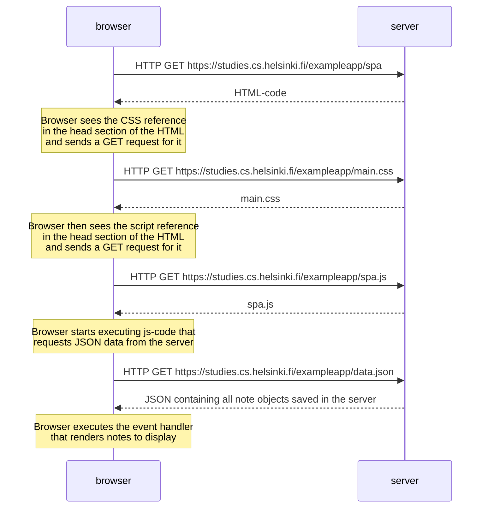

```mermaid
sequenceDiagram

browser->>server: HTTP GET https://studies.cs.helsinki.fi/exampleapp/spa
	
server-->>browser: HTML-code

note over browser: Browser sees the CSS reference<br>in the head section of the HTML<br>and sends a GET request for it

browser->>server: HTTP GET https://studies.cs.helsinki.fi/exampleapp/main.css

server-->>browser: main.css

note over browser: Browser then sees the script reference<br> in the head section of the HTML<br> and sends a GET request for it

browser->>server: HTTP GET https://studies.cs.helsinki.fi/exampleapp/spa.js

server-->>browser: spa.js

Note over browser: Browser starts executing js-code that <br> requests JSON data from the server

browser->>server: HTTP GET https://studies.cs.helsinki.fi/exampleapp/data.json

server-->>browser: JSON containing all note objects saved in the server

Note over browser: Browser executes the event handler <br> that renders notes to display
```