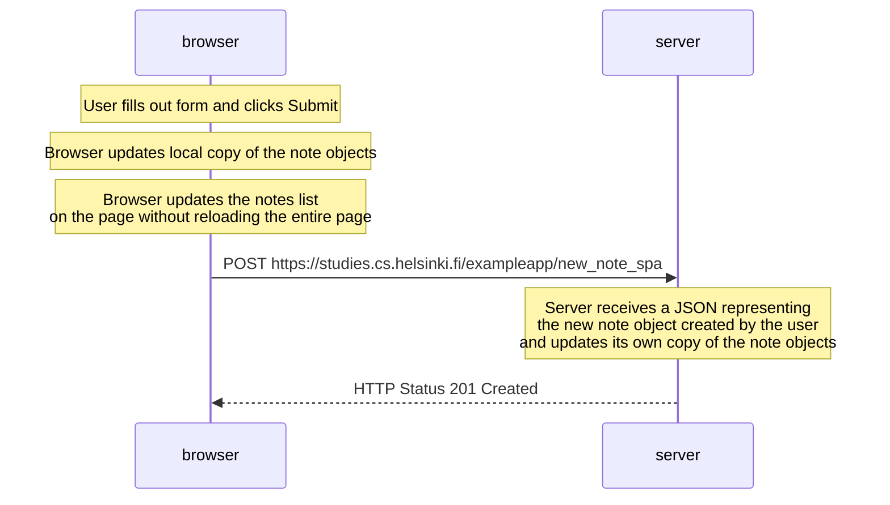

```mermaid
sequenceDiagram

note over browser: User fills out form and clicks Submit

note over browser: Browser updates local copy of the note objects

note over browser: Browser updates the notes list<br> on the page without reloading the entire page

browser->>server: POST https://studies.cs.helsinki.fi/exampleapp/new_note_spa

note over server: Server receives a JSON representing<br>the new note object created by the user<br>and updates its own copy of the note objects

server-->>browser: HTTP Status 201 Created
```